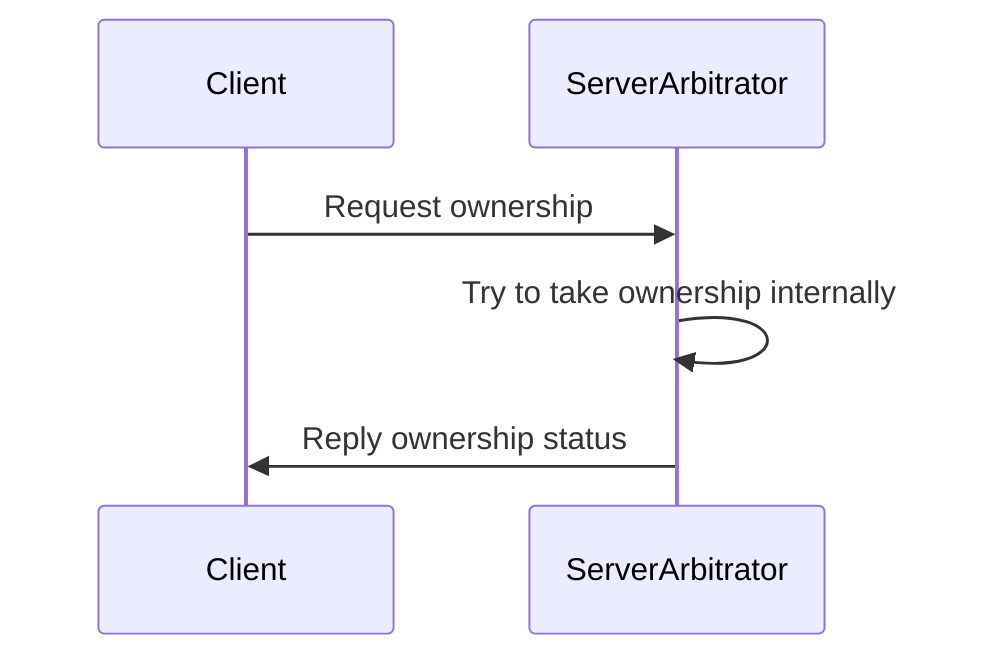

# Arbitrator example

This program is based on Request-Reply example provided by FastDDS to illustrate a way to handle arbitration ownership.

## Description of the example

The RPC like communication pattern is implemented using a pair of related topics, one for the request and one for the reply.
The approach creates the following data flow for a request-reply operation:



## Compile and run arbitrator server

```shell
cmake .
cmake --build .
./arbitrator server
```

## Compile and run arbitrator client

```shell
cmake .
cmake --build .
./arbitrator client 1 30
```

### Client options

./arbitrator client firstArg SecondArg
- firstArg: provenance service
  - 1: Powerhead
  - 2: Console
  - 3: Scanner Interface
- SecondArg: current strength
Unsigned 32 bits describing the current strength use by the service.
